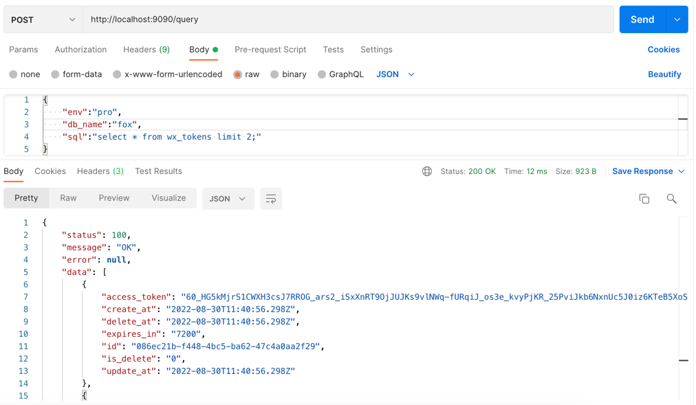

# cool

### 以服务为跳板，提供API访问数据库/Redis

###背景
API自动化测试时，部分测试工具(如postman)或者数据库/Redis内网无法直连。可以通过以服务为跳板来解决。

API自动化测试,需要校验/断言数据正确性，有时则需要访问数据库数据。如有些外部应用无法访问数据库，则解决方案就是提供一个可以查询数据库API。

###项目介绍
***
* golang 使用gin web框架

###使用说明
* .env配置mysql连接信息
* 提供query、execute接口
* 请求参数

`
{
"env":"pro",
"db_name":"db",
"sql":"select * from wx_tokens limit 2;"
}
`

*返回参数 json格式

`
{
"status": 100,
"message": "OK",
"error": null,
"data": [
{
"access_token": "1",
"create_at": "2022-08-30T11:40:56.298Z",
},
{
"access_token": "2",
"create_at": "2022-08-26T16:37:55.132Z",
}
]
}
`

